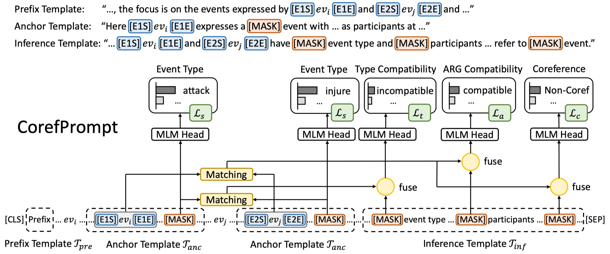

# CorefPrompt: Prompt-based Event Coreference Resolution by Measuring Event Type and Argument Compatibilities

This code was used in the paper:

"[CorefPrompt: Prompt-based Event Coreference Resolution by Measuring Event Type and Argument Compatibilities](https://arxiv.org/abs/2310.14512)"
Sheng Xu, Peifeng Li and Qiaoming Zhu. EMNLP 2023.

A simple prompt-based model implemented in PyTorch for resolving within-document event coreference. The model was trained and evaluated on the KBP corpus.



We first utilize a prefix template $\mathcal{T}_{pre}$ to inform PTM what to focus on when encoding, then mark event types and arguments by inserting anchor templates $\mathcal{T}_{anc}$ around event mentions, and finally demonstrate the reasoning process of ECR using an inference template $\mathcal{T}_{inf}$ which introduces two auxiliary prompt tasks, event-type compatibility and argument compatibility.

## Set up

Set up a Python virtual environment and install packages using the `requirements` file:

```bash
conda create -n corefprompt python=3.9
conda activate corefprompt
python3 -m pip install -r requirements.txt
```

Download the pre-trained model weights used in our experiment from Huggingface [Model Hub](https://huggingface.co/models):

```bash
bash download_pt_models.sh
```

**Note:** this script will save all downloaded weights in `./PT_MODELS/`.

## How to use

It is easy to use our model to predict event coreferences. For example, consider the following text, which contains seven event mentions ($ev_1$-$ev_7$) and ten entity mentions ($arg_1$-$arg_{10}$) that serve as arguments. 

$\{$Former Pakistani dancing girl$\}arg_1$ commits $\{$suicide$\}ev_1$ 12 years after horrific $\{$acid$\}arg_2$ $\{$attack$\}ev_2$ which $\{$left$\} ev_3$ $\{$her$\} arg_3$ looking "not human". $\{$She$\} arg_4$ had undergone 39 separate surgeries to repair $\{$damage$\} ev_4$. Leapt to $\{$her$\} arg_5$ $\{$death$\} ev_5$ from $\{$sixth floor Rome building$\} arg_6$ $\{$earlier this month$\} arg_7$. $\{$Her ex-husband$\} arg_8$ was $\{$charged$\} ev_6$ with $\{$attempted murder$\} arg_9$ in $\{$2002$\} arg_{10}$ but has since been $\{$acquitted$\} ev_7$.

Among them, 

- the death event mention $ev_1$ with the argument $arg_1$ and the death event mention $ev_5$ with the arguments $arg_5, arg_6,$ and $arg_7$ are coreferential, as both of them describe the girl's suicide by jumping off a building; 
- the injury event mention $ev_3$ with the arguments $arg_2$ and $arg_3$ and the injury event $ev_4$ with the argument $arg_4$ are coreferential, as both of them describe the girl's disfigurement; 
- other event mentions are singletons.

Let's apply our CorefPrompt to predict the coreference of events $ev_{1},ev_3,ev_4$ and $ev_{5}$. 

**Note:** For event arguments, we only care about participants and locations.

```python
document = 'Former Pakistani dancing girl commits suicide 12 years after horrific acid attack which left her looking "not human". She had undergone 39 separate surgeries to repair damage. Leapt to her death from sixth floor Rome building earlier this month. Her ex-husband was charged with attempted murder in 2002 but has since been acquitted.'

ev1 = {
    'offset': 38, 
    'trigger': 'suicide', 
    'args': [
        {'mention': 'Former Pakistani dancing girl', 'role': 'participant'}
    ]
}
ev3 = {
    'offset': 88, 
    'trigger': 'left', 
    'args': [
        {'mention': 'acid', 'role': 'participant'}, 
        {'mention': 'her', 'role': 'participant'}
    ]
}
ev4 = {
    'offset': 168, 
    'trigger': 'damage', 
    'args': [
        {'mention': 'She', 'role': 'participant'}
    ]
}
ev5 = {
    'offset': 189, 
    'trigger': 'death', 
    'args': [
        {'mention': 'her', 'role': 'participant'}, 
        {'mention': 'sixth floor Rome building', 'role': 'place'}
    ]
}
```

First, we need to set the `args` variable that organizes all parameters:

```python
from corefprompt import args, CorefPrompt

args.model_checkpoint='../PT_MODELS/roberta-large/'
args.best_weights='./epoch_2_dev_f1_71.5876_weights.bin'

coref_model = CorefPrompt(args.model_checkpoint, args.best_weights, args)
```

Here, `args.model_checkpoint` and `args.best_weights` are paths to the checkpoint and our trained weights, respectively.

> RoBERTa checkpoint can be downloaded by running the script `download_pt_models.sh` above, and our best weights `epoch_2_dev_f1_71.5876_weights.bin` can be downloaded from [Google Drive](https://drive.google.com/drive/folders/1XoJBHIEaCbH8bf0Sdd9vJVqNRS6r9SUV?usp=share_link).

We provide two functions to predict event coreferences:

- **CorefPrompt.predict_coref(event1, event2)**: suitable for processing multiple event pairs located in the same document. It is necessary to first initialize the corresponding document using the `CorefPrompt.init_document(doc)` function.
- **CorefPrompt.predict_coref_in_doc(document, event1, event2)**: directly predict coreference between the event pair located in a document.

```python
# direct predict event pairs
res = coref_model.predict_coref_in_doc(document, ev1, ev5)
print(f"ev1[{ev1['trigger']}] - ev5[{ev5['trigger']}]: {res['label']} ({res['probability']})")
```

```
ev1[suicide] - ev5[death]: coref (0.9997438788414001)
```

```python
# predict event pairs in the same document
coref_model.init_document(document)
res = coref_model.predict_coref(ev1, ev5)
print(f"ev1[{ev1['trigger']}] - ev5[{ev5['trigger']}]: {res['label']} ({res['probability']})")
res = coref_model.predict_coref(ev1, ev3)
print(f"ev1[{ev1['trigger']}] - ev3[{ev5['trigger']}]: {res['label']} ({res['probability']})")
res = coref_model.predict_coref(ev1, ev4)
print(f"ev1[{ev1['trigger']}] - ev4[{ev5['trigger']}]: {res['label']} ({res['probability']})")
res = coref_model.predict_coref(ev3, ev4)
print(f"ev3[{ev1['trigger']}] - ev4[{ev5['trigger']}]: {res['label']} ({res['probability']})")
```

```
ev1[suicide] - ev5[death]: coref (0.9997438788414001)
ev1[suicide] - ev3[death]: non-coref (0.9977204203605652)
ev1[suicide] - ev4[death]: non-coref (0.9989845156669617)
ev3[suicide] - ev4[death]: coref (0.999984622001648)
```

You can modify the [demo.py]() file to try it out!

## Training & Evaluation on the KBP corpus

### Preparation

#### Download the evaluation script

Coreference results are obtained using official [**Reference Coreference Scorer**](https://github.com/conll/reference-coreference-scorers). This scorer reports results in terms of AVG-F, which is the unweighted average of the F-scores of four commonly used coreference evaluation metrics, namely $\text{MUC}$ ([Vilain et al., 1995](https://www.aclweb.org/anthology/M95-1005/)), $\text{B}^3$ ([Bagga and Baldwin, 1998](https://citeseerx.ist.psu.edu/viewdoc/download?doi=10.1.1.47.5848&rep=rep1&type=pdf)), $\text{CEAF}_e$ ([Luo, 2005](https://www.aclweb.org/anthology/H05-1004/)) and $\text{BLANC}$ ([Recasens and Hovy, 2011](https://www.researchgate.net/profile/Eduard-Hovy/publication/231881781_BLANC_Implementing_the_Rand_index_for_coreference_evaluation/links/553122420cf2f2a588acdc95/BLANC-Implementing-the-Rand-index-for-coreference-evaluation.pdf)).

Run (from inside the repo):

```bash
cd ./
git clone git@github.com:conll/reference-coreference-scorers.git
```

#### Prepare the dataset

This repo assumes access to the English corpora used in TAC KBP Event Nugget Detection and Coreference task (i.e., [KBP 2015](http://cairo.lti.cs.cmu.edu/kbp/2015/event/), [KBP 2016](http://cairo.lti.cs.cmu.edu/kbp/2016/event/), and [KBP 2017](http://cairo.lti.cs.cmu.edu/kbp/2017/event/)). In total, they contain 648 + 169 + 167 = 984 documents, which are either newswire articles or discussion forum threads.

```
'2015': [
    'LDC_TAC_KBP/LDC2015E29/data/', 
    'LDC_TAC_KBP/LDC2015E68/data/', 
    'LDC_TAC_KBP/LDC2017E02/data/2015/training/', 
    'LDC_TAC_KBP/LDC2017E02/data/2015/eval/'
],
'2016': [
    'LDC_TAC_KBP/LDC2017E02/data/2016/eval/eng/nw/', 
    'LDC_TAC_KBP/LDC2017E02/data/2016/eval/eng/df/'
],
'2017': [
    'LDC_TAC_KBP/LDC2017E54/data/eng/nw/', 
    'LDC_TAC_KBP/LDC2017E54/data/eng/df/'
]
```

|                 | KBP 2015 | KBP 2016 | KBP 2017 | All   |
| --------------- | -------- | -------- | -------- | ----- |
| #Documents      | 648      | 169      | 167      | 984   |
| #Event mentions | 18739    | 4155     | 4375     | 27269 |
| #Event Clusters | 11603    | 3191     | 2963     | 17757 |

Following [Lu & Ng, (2021)](https://aclanthology.org/2021.emnlp-main.103/), we select LDC2015E29, E68, E73, E94 and LDC2016E64 as train set (817 docs, 735 for training and the remaining 82 for parameter tuning), and report results on the KBP 2017 dataset.

**Dataset Statistics:**

|                 | Train | Dev  | Test | All   |
| --------------- | ----- | ---- | ---- | ----- |
| #Documents      | 735   | 82   | 167  | 984   |
| #Event mentions | 20512 | 2382 | 4375 | 27269 |
| #Event Clusters | 13292 | 1502 | 2963 | 17757 |

Then,

1. Download the `kbp_sent.txt` from the [Github repository](https://github.com/jsksxs360/event-coref-emnlp2022) of previous work ([Xu et al., 2022](https://aclanthology.org/2022.emnlp-main.454/)), which contains sentences splited using Stanford CoreNLP, and place it in the `./data` directory.

2. Convert the original dataset into jsonlines format using:

   ```bash
   cd data/
   
   export DATA_DIR=<ldc_tac_kbp_data_dir>
   export SENT_DIR=./
   
   python3 convert.py --kbp_data_dir $DATA_DIR --sent_data_dir $SENT_DIR
   ```

   **Note:** this script will create `train.json`、`dev.json` and `test.json` in the *data* folder, as well as `train_filtered.json`、`dev_filtered.json` and `test_filtered.json` which filter same or overlapping event mentions.

3. Use the [trigger detector](https://github.com/jsksxs360/event-coref-emnlp2022#download-final-model) provided by [Xu et al., (2022)](https://aclanthology.org/2022.emnlp-main.454/) to extract event triggers in the test set, and store the results in the `./data/epoch_3_test_pred_events.json` file.

4. Install the [OmniEvent](https://github.com/THU-KEG/OmniEvent) tool via `pip install OmniEvent`, download model weights, and then recognize event arguments using:

   ```bash
   cd data/KnowledgeExtraction/
   
   python3 omni_argument_extraction.py
   ```

   **Note:** this script will create `xxx_pred_args.json` files in the *data/KnowledgeExtraction/argument_files* folder.

### Undersampling

To reduce the computational cost, we apply undersampling on the training set based on the event similarities.

#### Training

Train an event similarity scorer, which can output similar event embeddings for coreferential event mentions and then calculate cosine values as event similarities (Run with `--do_train`):

```bash
cd src/sample_selector/

export OUTPUT_DIR=./results/

python3 run_selector.py \
    --output_dir=$OUTPUT_DIR \
    --model_type=longformer \
    --model_checkpoint=../../PT_MODELS/allenai/longformer-large-4096/ \
    --train_file=../../data/train_filtered.json \
    --dev_file=../../data/dev_filtered.json \
    --test_file=../../data/test_filtered.json \
    --pred_test_file=../../data/epoch_3_test_pred_events.json \
    --max_seq_length=4096 \
    --learning_rate=1e-5 \
    --num_train_epochs=30 \
    --batch_size=1 \
    --do_train \
    --warmup_proportion=0. \
    --seed=42
```

After training, the model weights and the evaluation results on **Dev** set would be saved in `$OUTPUT_DIR`. Then use `--do_predict` parameter to predict event similarities. The predicted results, i.e., `XXX_with_cos.json`, would be saved in `$OUTPUT_DIR`.

Finally, create event info files based on recognized arguments and event similarities:

```bash
cd data/KnowledgeExtraction/

python3 related_info_extraction.py
```

This will create `xxx_related_info_{cosine_threshold}.json` files in the *data/KnowledgeExtraction/simi_files* folder, which contain the arguments of each event and the related event information with high similarity.

### Event Coreference Resolution

#### Training

Train our prompt-based model CorefPrompt using (Run with `--do_train`):

```
cd src/coref_prompt/

export OUTPUT_DIR=./roberta_m_hta_hn_512_with_mask_product_cosine_results/

python3 run_mix_prompt.py \
    --output_dir=$OUTPUT_DIR \
    --prompt_type=m_hta_hn \
    --with_mask \
    --select_arg_strategy=no_filter \
    --matching_style=product_cosine \
    --cosine_space_dim=64 \
    --cosine_slices=128 \
    --cosine_factor=4 \
    --model_type=roberta \
    --model_checkpoint=../../PT_MODELS/roberta-large/ \
    --train_file=../../data/train_filtered.json \
    --train_file_with_cos=../../data/train_filtered_with_cos.json \
    --dev_file=../../data/dev_filtered.json \
    --test_file=../../data/test_filtered.json \
    --train_simi_file=../../data/KnowledgeExtraction/simi_files/simi_omni_train_related_info_0.75.json \
    --dev_simi_file=../../data/KnowledgeExtraction/simi_files/simi_omni_dev_related_info_0.75.json \
    --test_simi_file=../../data/KnowledgeExtraction/simi_files/simi_omni_gold_test_related_info_0.75.json \
    --pred_test_simi_file=../../data/KnowledgeExtraction/simi_files/simi_omni_epoch_3_test_related_info_0.75.json \
    --sample_strategy=corefnm \
    --neg_top_k=3 \
    --max_seq_length=512 \
    --learning_rate=1e-5 \
    --num_train_epochs=10 \
    --batch_size=4 \
    --do_train \
    --warmup_proportion=0. \
    --seed=42
```

After training, the model weights and evaluation results on **Dev** set would be saved in `$OUTPUT_DIR`. Then use `--do_predict` parameter to predict coreferences for event mention pairs. The predicted results, i.e., `XXX_test_pred_corefs.json`, would be saved in `$OUTPUT_DIR`.

#### Clustering

Create the final event clusters using predicted pairwise results:

```
cd src/clustering

export OUTPUT_DIR=./TEMP/

python3 run_cluster.py \
    --output_dir=$OUTPUT_DIR \
    --test_golden_filepath=../../data/test.json \
    --test_pred_filepath=event-event/xxx_test_pred_corefs.json \
    --golden_conll_filename=gold_test.conll \
    --pred_conll_filename=pred_test.conll \
    --do_evaluate
```

### Results

You can download the final **Event Similarity Scorer** & **CorefPrompt (event coreference model)** weights at:

[https://drive.google.com/drive/folders/1XoJBHIEaCbH8bf0Sdd9vJVqNRS6r9SUV?usp=share_link](https://drive.google.com/drive/folders/1XoJBHIEaCbH8bf0Sdd9vJVqNRS6r9SUV?usp=share_link)

| Model                                                        | MUC  | B3   | CEA  | BLA  | AVG  |
| ------------------------------------------------------------ | ---- | ---- | ---- | ---- | ---- |
| BERT                                                         | 35.8 | 54.4 | 55.6 | 36.0 | 45.5 |
| RoBERTa                                                      | 37.9 | 55.9 | 57.3 | 38.3 | 47.3 |
| [(Lu & Ng, 2021)](https://aclanthology.org/2021.emnlp-main.103/) | 45.2 | 54.7 | 53.8 | 38.2 | 48.0 |
| [(Xu et al., 2022)](https://aclanthology.org/2022.emnlp-main.454/) | 46.2 | 57.4 | 59.0 | 42.0 | 51.2 |
| CorefPrompt                                                  | 45.3 | 57.5 | 59.9 | 42.3 | 51.3 |

## Contact info

Contact [Sheng Xu](https://github.com/jsksxs360) at *[sxu@stu.suda.edu.cn](mailto:sxu@stu.suda.edu.cn)* for questions about this repository.